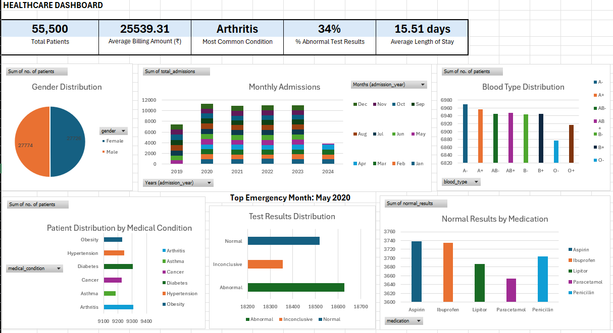

# 🏥 healthcare_sql_analysis
A complete healthcare data analysis project using SQL and Excel, featuring patient insights, hospital metrics, and a visual dashboard. 

## 📊 Summary Dashboard
- **Total Patients:** 55,500  
- **Average Billing Amount:** ₹25,539.31  
- **Most Common Condition:** Arthritis  
- **% Abnormal Test Results:** 34%  
- **Average Length of Stay:** 15.51 days

## 🔧 Tools Used
- **PostgreSQL (pgAdmin)** — data querying, filtering, grouping, and aggregation  
- **Microsoft Excel** — pivot tables, charts, and dashboard  

## 🗂 Files in this reposiory
-healthcare analytics.xlsx       
-healthcare_dashboard_preview.png                      
-queries_patients_records1.sql                      
-queries_outputs
├── patients_by_condition.csv
├── test_results_distribution.csv
├── avg_stay_by_admission.csv
├── emergency_peak_month.csv
├── monthly_admissions.csv
├── normal_results_by_medication.csv
├── abnormal_results_by_medication.csv
-data
├── healthcare_dataset.csv                  

## ✅ Tasks Performed
Each task involved SQL querying and visual representation using Excel:
1. **Gender Distribution**  
2. **Blood Type Distribution**  
3. **Abnormal Test Results by Medication**  
4. **Normal Test Results by Medication**  
5. **Patients by Medical Condition**  
6. **Test Results Distribution (Normal / Abnormal / Inconclusive)**  
7. **Average Length of Stay by Admission Type**  
8. **Top Emergency Admission Month**  
9. **Monthly Admissions Over Years**  
10. **Average and Maximum Billing Amount by Medical Condition**

## 🚀 Project Skills Showcased
1. SQL querying for real-world medical records
2. Building interactive Excel dashboards for business insights
3. Applying domain knowledge to patient data (e.g., conditions, test outcomes)
